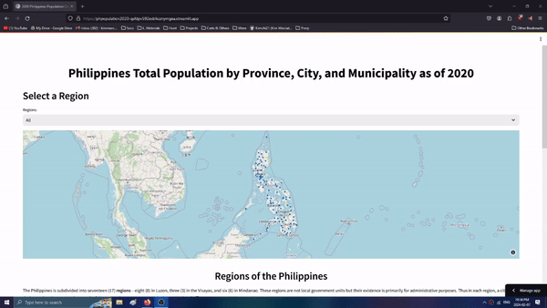

# Philippines Total Population by Province, City, and Municipality as of 2020
This streamlit app offers insights into population distribution across provinces, cities, and municipalities as of 2020.

## App Demo

### Data Sources
- Data on population derived from the [Philippine Statistics Authority](https://psa.gov.ph/content/2020-census-population-and-housing-2020-cph-population-counts-declared-official-president).

- Additional data derived from [PhilAtlas](https://psa.gov.ph/content/2020-census-population-and-housing-2020-cph-population-counts-declared-official-president).